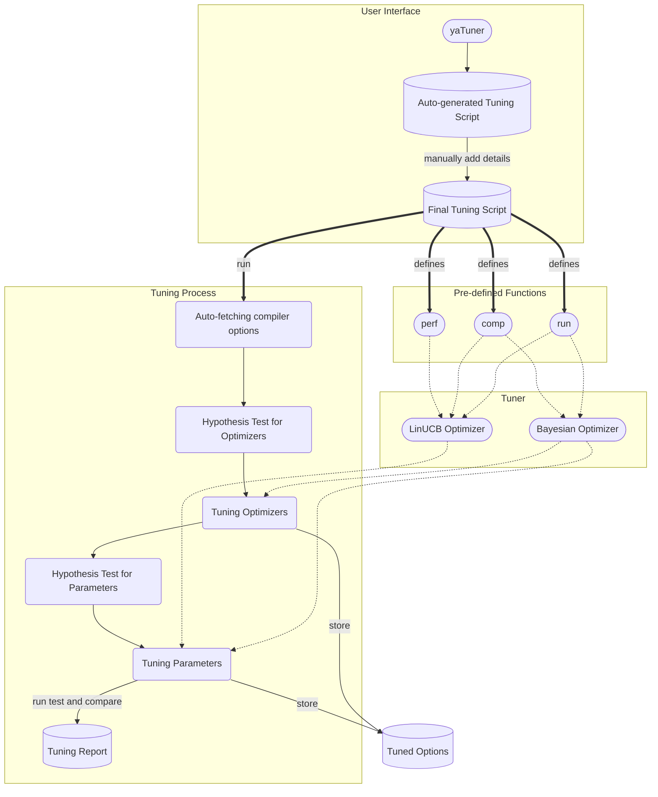

English | [简体中文](README_CN.md)

# yaTuner

yaTuner: yet another auto tuner for compilers.

## Getting Started

A virtual environment can be created using `make init` and examples are placed at directory `examples`.

To tune a program, use `yatuner -g <filename>` to generate a basic template for the program. Then modify the the script for further use. More information about the tuning script is contained in the template.

Also, `yatuner.utils` includes tools that might be necessary for use, here is a brief summary:

| Tool                                         | Functionality                                     |
| -------------------------------------------- | ------------------------------------------------- |
| `yatuner.utils.execute`                      | Execute command                                   |
| `yatuner.utils.fetch_perf_stat`              | Get the result of `perf stat` of certain command  |
| `yatuner.utils.fetch_arch`                   | fetch the architecture of the machine             |
| `yatuner.utils.fetch_gcc_version`            | fetch the gcc version                             |
| `yatuner.utils.fetch_gcc_optimizers`         | fetch the gcc optimizers                          |
| `yatuner.utils.fetch_gcc_parameters`         | fetch the gcc parameters                          |
| `yatuner.utils.fetch_gcc_enabled_optimizers` | fetch the gcc enabled optimizers of given options |
| `yatuner.utils.fetch_size`                   | fetch a file size                                 |

These tools can be used in the tuning script, see `examples` for details.

The tuning process and relative methods and their functionalities are listed as below.

| Method                      | Functionality                              |
| --------------------------- | ------------------------------------------ |
| `tuner.initialize`          | Initialize workspace                       |
| `tuner.test_run`            | Doing an initial test run                  |
| `tuner.hypotest_optimizers` | Hypothesis test for optimizers             |
| `tuner.hypotest_parameters` | Hypothesis test for parameters             |
| `tuner.optimize`            | Tune parameters with Bayesian Optimization |
| `tuner.optimize_linUCB`     | Tune parameters with LinUCB                |
| `tuner.run`                 | Run final test and generate result         |
| `tuner.plot_data`           | Plot result in violin graph                |

## Usage

1. Install yaTuner.
2. Auto-generate tuning script with `yatuner -g <filename>`.
3. Manually modify tuning script and add details.
4. Run tuning script with `python <filename>`.

## Architecture

## License

yaTuner is licensed under Mulan PSL v2. See [LICENSE](LICENSE) for more details.

## About

This is a project for the OS competition 2022, proj105 problem, see [this](https://github.com/oscomp/proj105-auto-tune-for-compiler) for further information.