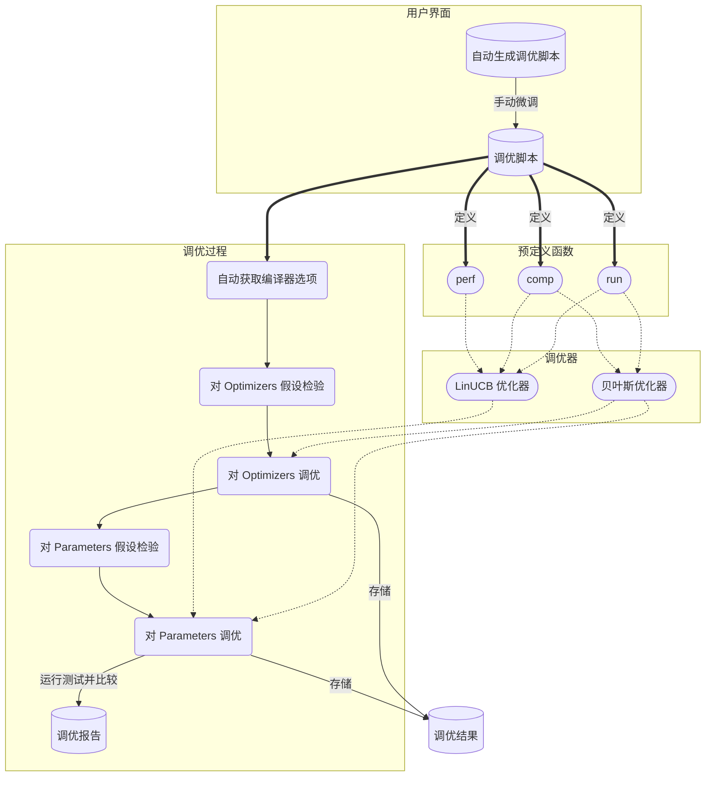

[English](README.md) | 简体中文

# yaTuner

一个编译器自动调优器。

## 开始使用 yaTuner

使用 `make init` 可以创建一个虚拟环境，所有例子都位于 `examples` 目录下。

在对一个项目进行优化前，使用 `yatuner -g <filename>` 生成初始调优脚本模板，对此模板进行修改以适应项目具体情况。生成的初始模板中包含了有关对象的具体信息。

在 `yatuner.utils` 模块中包含了一些可能会用到的工具，此处是一个简单的汇总：

| 工具                                           | 功能                   |
| -------------------------------------------- | -------------------- |
| `yatuner.utils.execute`                      | 执行命令                 |
| `yatuner.utils.fetch_perf_stat`              | 获取 `perf stat` 的结果   |
| `yatuner.utils.fetch_arch`                   | 获取平台架构               |
| `yatuner.utils.fetch_gcc_version`            | 获取 gcc 版本            |
| `yatuner.utils.fetch_gcc_optimizers`         | 获取 gcc 优化器           |
| `yatuner.utils.fetch_gcc_parameters`         | 获取 gcc 优化参数          |
| `yatuner.utils.fetch_gcc_enabled_optimizers` | 获取 gcc 中某一个选项所打开的优化器 |
| `yatuner.utils.fetch_size`                   | 获取文件大小               |

这些工具可以在调优脚本中使用以加快开发速度，详见 `examples` 中具体的使用例子.

## 架构

## 关于

本项目是对 2022全国大学生操作系统比赛功能赛道 proj105 题目的实现，详见 [proj105 repo](https://github.com/oscomp/proj105-auto-tune-for-compiler)。